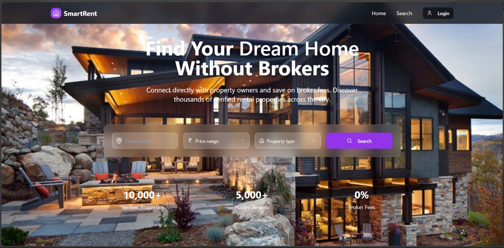
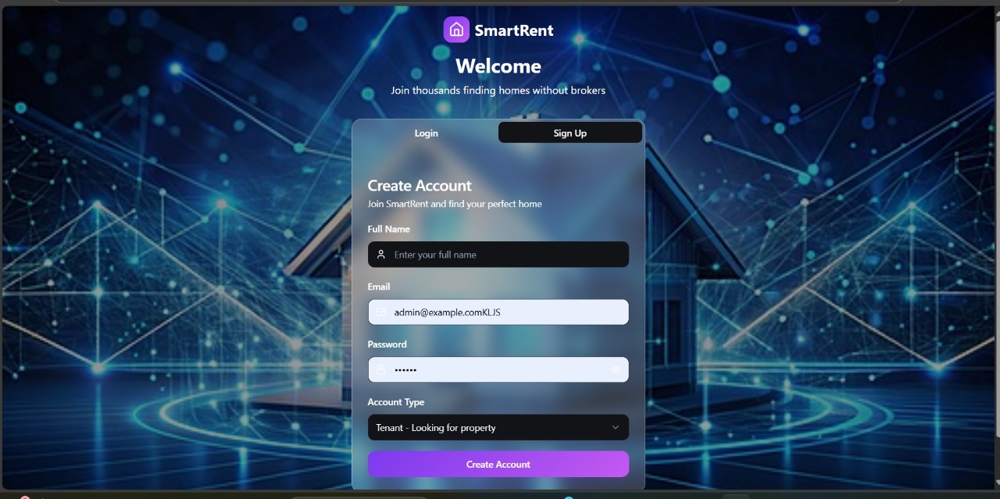
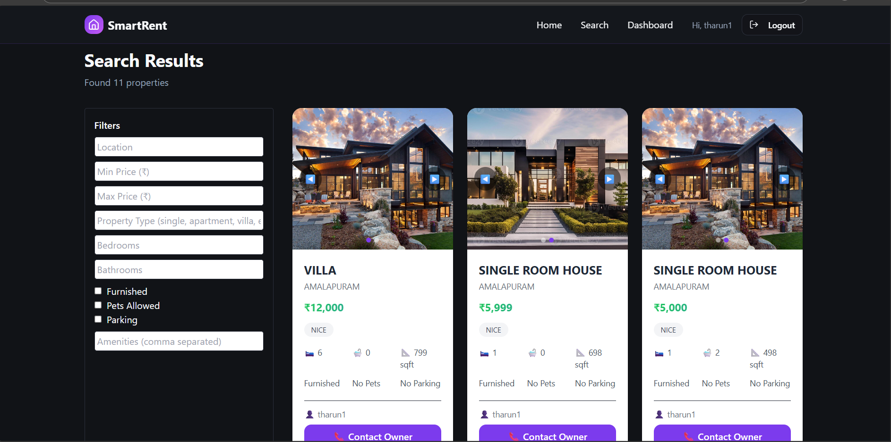
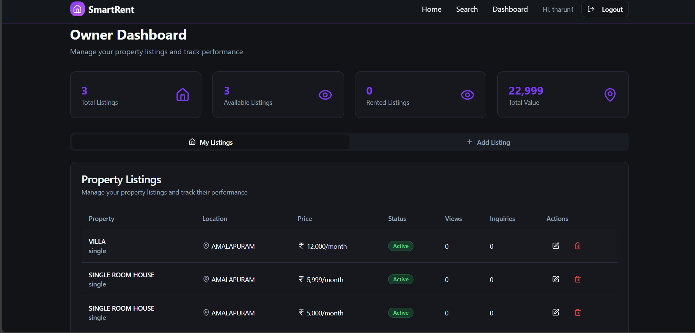
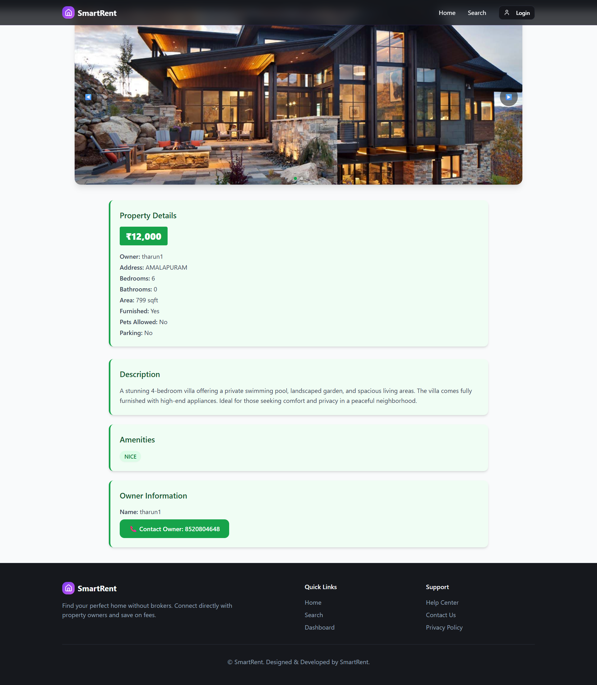

# 🏠 SmartRent – Modern Rental Management Platform

   

A *full-stack rental management system* built with *Node.js (Express), React, and MongoDB* — making property listing, tenant management, and rent tracking *simpler, faster, and broker-free*.

## 🌐 Live Demo

[🚀 Visit Live Demo](https://smart-renter-05od.onrender.com )

---

## 📸 UI Screenshots

### 🏠 Home Page

### 🔐 Login Page

### 📝 Registration Page

### 🏘 Property Listings

### 🧑‍💼 Owner Dashboard

### 📄 View Property Details

---

## ✨ Features

### 👨‍💼 Owner Portal

* 🏘 Add, edit, and delete property listings
* 📸 Upload property images with *Multer*
* 📊 Track inquiries & tenant applications
* ✅ Submit properties for *admin approval*

### 👨‍🎓 Tenant Portal

* 🔍 Search & filter properties by price, location, and type
* 🏡 View detailed property pages
* 📝 Apply/request booking directly
* 💬 Contact property owners

### 🛡 Admin Panel

* ✅ Approve or reject property listings
* 🧾 Manage tenants and owners
* 📊 Export data for reports
* 🚨 Ensure verified and safe property transactions

---

## 🧰 Tech Stack

### 🔠 Frontend

* *Type Script* (functional components + hooks)
* *Tailwind CSS* for responsive UI
* *Axios* for API requests
* *Lucide Icons & React Icons* for modern UI

### 🔙 Backend

* *Node.js + Express.js* for REST APIs
* *MongoDB + Mongoose* for database

### 🔐 Authentication

* JWT-based login/signup
* Role-based access (Admin, Owner, Tenant)
* Protected routes on frontend & backend

---

## 📁 Project Structure

smart-rent/
├── backend/                # Express + MongoDB API
│   ├── controllers/        # Route logic
│   ├── models/             # MongoDB schemas
│   ├── routes/             # API routes
│   └── middleware/         # JWT auth, role guards
├── frontend/               # React client
│   ├── public/             # Static assets
│   └── src/
│       ├── components/     # Navbar, Cards, Inputs, etc.
│       ├── pages/          # Owner, Tenant, Admin pages
│       └── utils/          # Axios instance, auth helpers

---

## 🚀 Getting Started

### ⚙ Backend Setup

bash
cd backend
npm install express mongoose dotenv bcrypt axios jsonwebtoken
node server.js

### 💻 Frontend Setup

bash
cd frontend
npm install
npm run dev

## 🛡 Security Measures

* JWT with refresh tokens
* Role-based API guards
* Input sanitization + validation
* Password hashing with bcrypt

---

## 🔮 Planned Enhancements

* 📱 Mobile App (React Native)
* 🔔 Push Notifications (property updates)
* 💳 Online Rent Payment Integration
* 🤖 AI-powered smart property recommendations

---

## 📃 License

This project is licensed under the *MIT License*.

> MIT License
> Copyright (c) 2025 *THARUN LOKESH*

---

## 👨‍💻 Author

*Tharun Lokesh Uggina*
🔗 [LinkedIn](https://www.linkedin.com/in/naveenkumarinakollu)
📧 (mailto:inakollun@gmail.com)

---

## 🌟 Show Your Support

If you like this project, *star ⭐ it, fork 🍴 it, and share 💬 it* with your developer friends!

---
